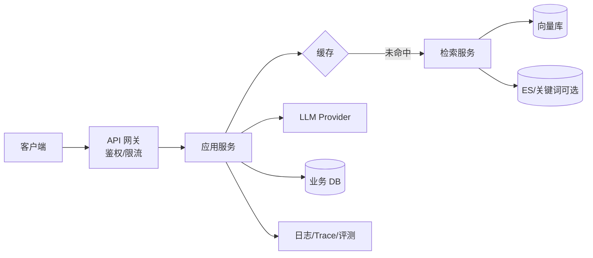
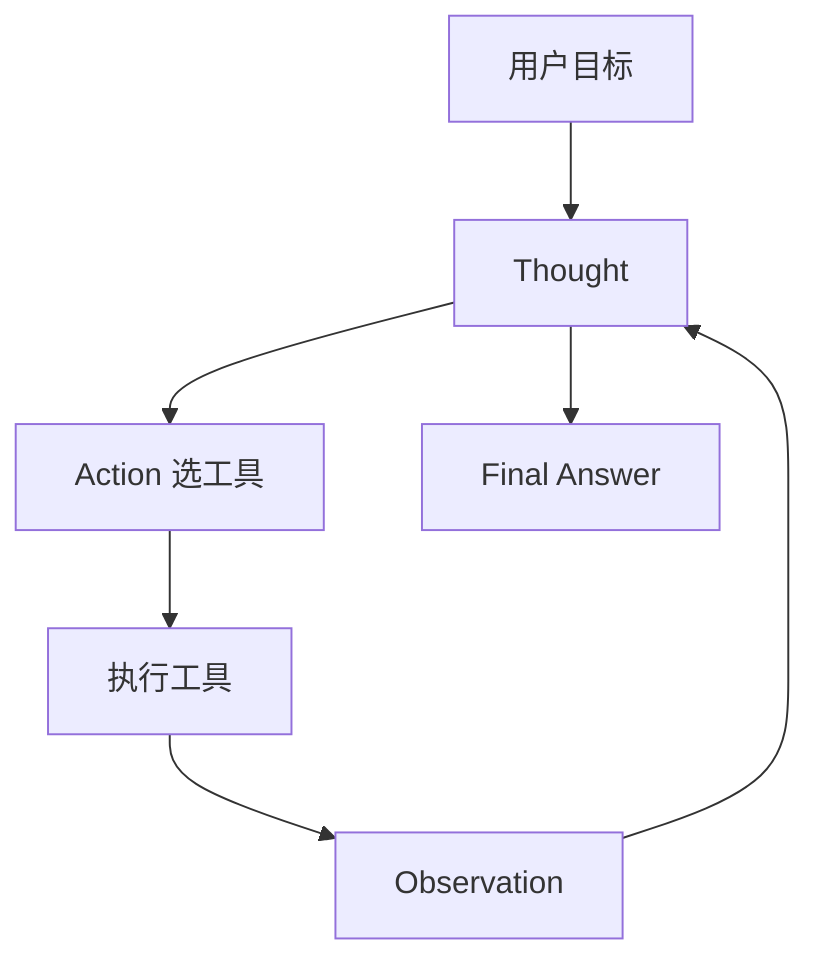
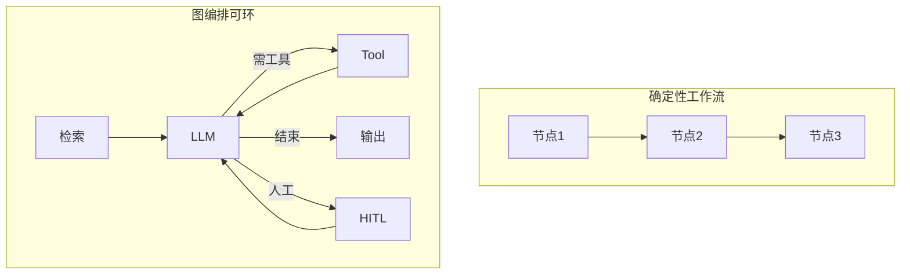
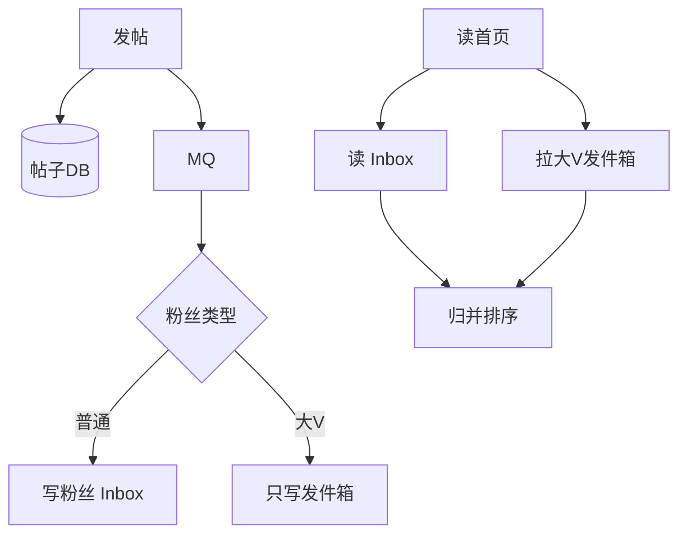
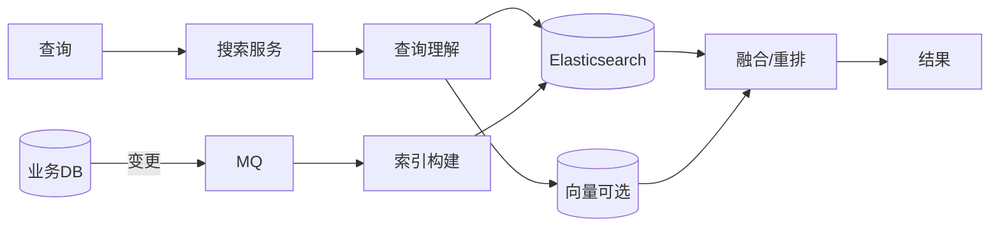
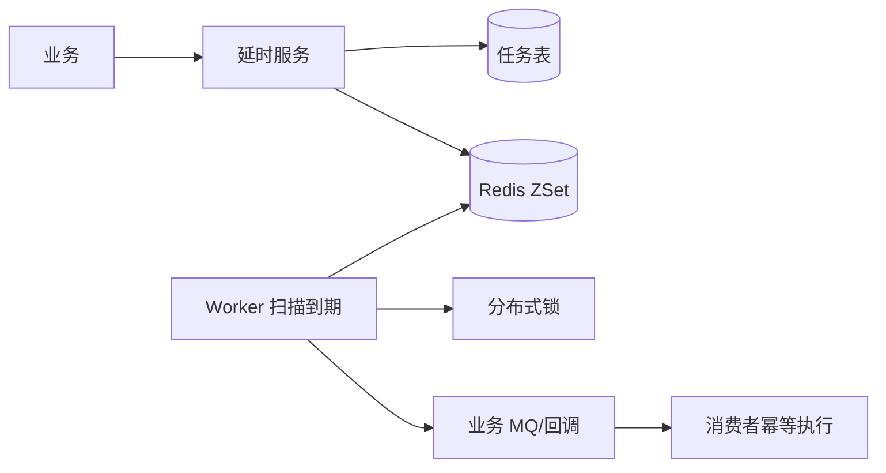
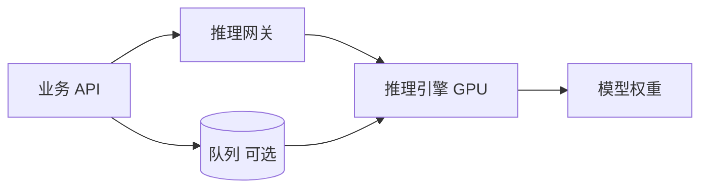
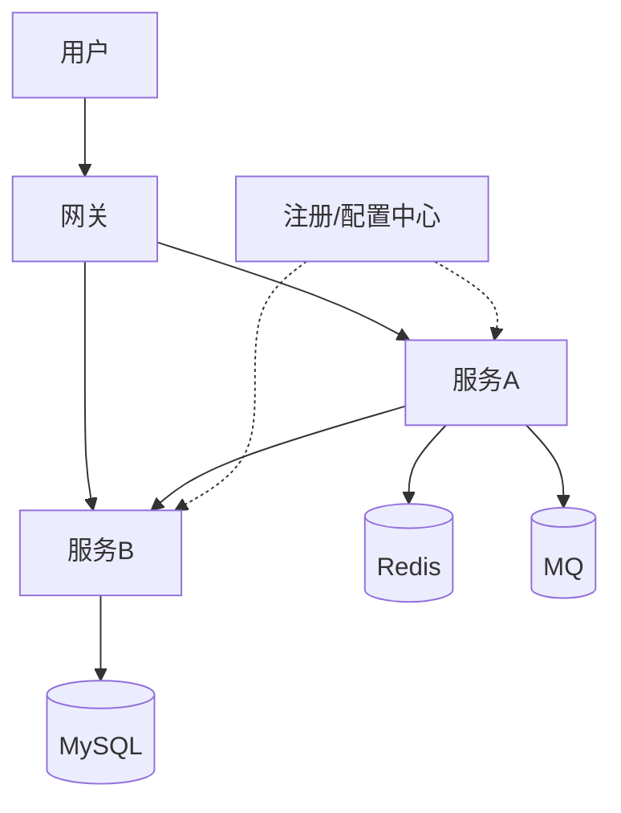

# 架构图集（面试可手绘）

> 用 **Mermaid** 便于仓库内预览；面试白板用方框+箭头即可。  
> 总索引：[README.md](./README.md)

---

## 1. AI 应用 / RAG 总览

**口述一句：** 网关进服务，检索增强后调模型，全链路可观测。

---

## 2. Agent 循环

**约束：** max_steps / 权限 / HITL 画在 Action 旁。

---

## 3. LangGraph / 工作流对比（逻辑）

---

## 4. Feed 混合模式

---

## 5. 搜索链路

---

## 6. 延时消息

---

## 7. 推理部署分离

---

## 8. 微服务治理

---

## 白板提示

- 先画 **请求路径** 再补 **存储与异步**  
- 标出 **瓶颈点**（热点、一致性、限流）  
- 每张图准备 **30 秒讲解**

---

## 修订

| 日期 | 说明 |
|------|------|
| 2026-07-21 | 架构图集初版 |
