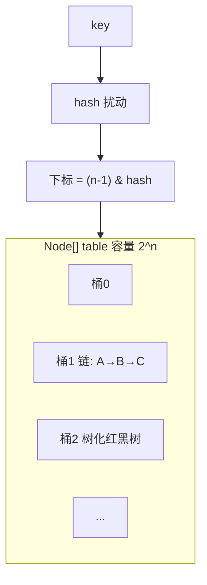
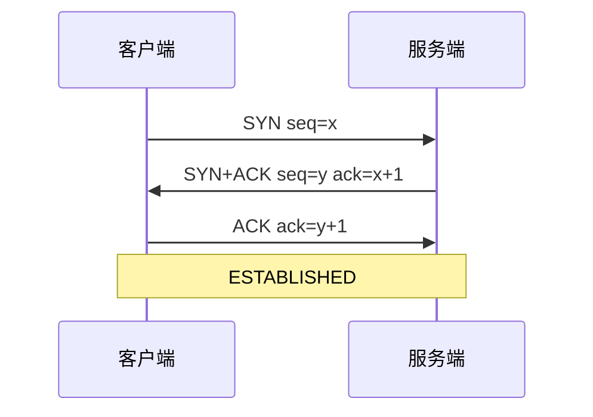
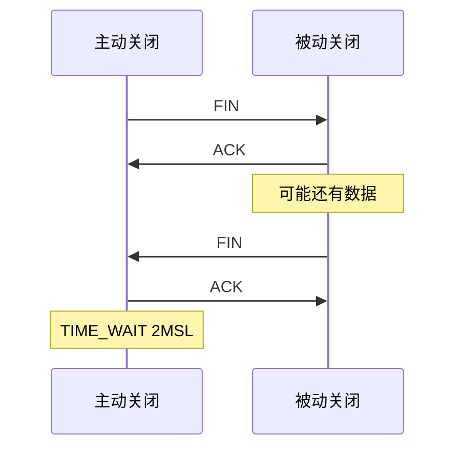
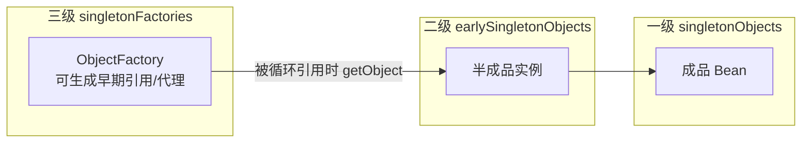
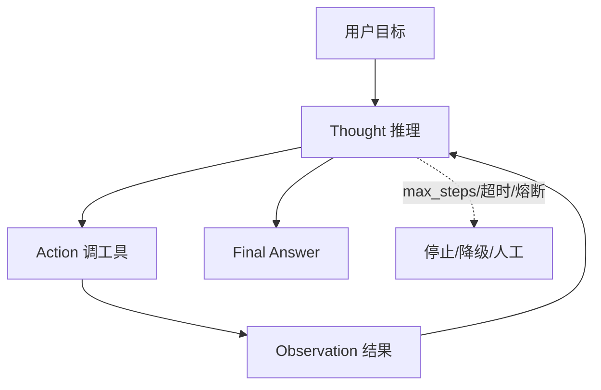
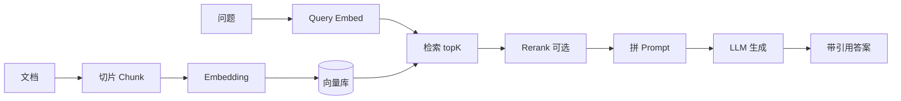

# 核心结构图（面试白板速记）

> 五张图覆盖最高频考点。面试用手绘方框即可；本页用 Mermaid 方便预览。  
> 对应完整卷见文末链接。

---

## 1. HashMap（JDK8）



**口述锚点：**

```text
put: hash → 下标 → 空放/equals覆盖/链尾插
链长≥8 且 表长≥64 → 红黑树
size > 容量×0.75 → 扩容 2 倍
多线程不安全 → ConcurrentHashMap
```

**白板：** 画一排格子 + 一条链 + 一个树图标。  
**完整卷：** [集合](./Java集合框架高频面试题与知识点.md)

---

## 2. TCP 三次握手 / 四次挥手

### 三次握手



**为何三次：** 同步双方序号 + 确认收发能力；防历史 SYN。

### 四次挥手 + TIME_WAIT



**TIME_WAIT：** 保最后 ACK；清旧包。  
**CLOSE_WAIT 多：** 应用未 close。  
**完整卷：** [网络](./计算机网络高频面试题与知识点.md)

---

## 3. Spring 三级缓存（循环依赖）



**A→B→A 口述：**

```text
创建A → 工厂进三级
A 要 B → 创建B
B 要 A → 从三级拿A早期引用
B 完成进一级 → A 填完进一级
```

**解不了：** 构造器循环、prototype。  
**完整卷：** [Spring](./Spring高频面试题与知识点.md)

---

## 4. ReAct（Agent）



**护栏：** max_steps、重复检测、超时、工具熔断、HITL。  
**完整卷：** [AI-Agent](./AI-Agent高频面试题与知识点.md)

---

## 5. RAG Pipeline



**防幻觉：** 引用、拒答、阈值、评测。  
**Hybrid：** 向量 + 关键词。  
**完整卷：** [AI-Agent·RAG](./AI-Agent高频面试题与知识点.md) · [向量库](./向量库高频面试题与知识点.md)

---

## 白板 30 秒口诀

| 图 | 一句话 |
|----|--------|
| HashMap | 数组 + 链/树，hash 进桶 |
| 握手 | SYN 两回一确认 |
| 挥手 | 各关一边，TIME_WAIT 等 |
| 三级缓存 | 工厂→半成品→成品 |
| ReAct | 想→做→看→再想 |
| RAG | 切→嵌→搜→(排)→生成 |

---

## 相关

- [架构图集.md](./架构图集.md)（更多业务架构图）  
- [模拟面试-Java20问](./模拟面试-Java20问.md) · [模拟面试-AI20问](./模拟面试-AI20问.md)  

[← 首页](./README.md)
